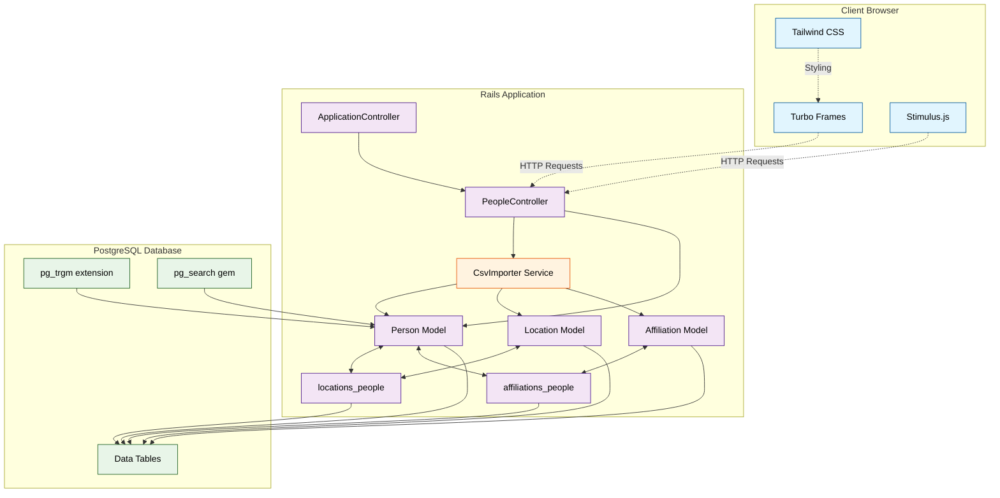

# Galactic Census

## Quick Start (Docker)

```bash
# 1. Clone the repository
git clone <repo-url> && cd sentia_coding_challenge

# 2. Start the app (builds + boots Rails + PostgreSQL)
docker compose up --build

# 3. Open in browser
open http://localhost:3000
```

The Docker entrypoint automatically runs `db:prepare` on first boot. Database seeding is disabled by default - use the CSV import form to add data.

## Running Tests

```bash
# Run the full test suite in Docker
docker-compose exec web bundle exec rspec

# Or run specific test files
docker-compose exec web bundle exec rspec spec/models/
docker-compose exec web bundle exec rspec spec/requests/
docker-compose exec web bundle exec rspec spec/services/

# Run tests with detailed output
docker-compose exec web bundle exec rspec --format documentation
```

**Test Coverage:**

- **Model tests**: Person validations, associations, and search functionality
- **Request tests**: HTTP endpoints, search, pagination, sorting, CSV import
- **Service tests**: CsvImporter functionality and error handling
- **Comprehensive test suite** with full coverage of core features

## Tech Stack

| Layer          | Technology                               |
| -------------- | ---------------------------------------- |
| Framework      | Ruby on Rails 8.1.2                      |
| Database       | PostgreSQL with pg_trgm extension        |
| Search         | PgSearch (full-text + trigram)           |
| Frontend       | Hotwire (Turbo Frames + Stimulus)        |
| Styling        | Tailwind CSS v4                          |
| Pagination     | Kaminari                                 |
| Testing        | RSpec 3.13, FactoryBot, Shoulda Matchers |
| Infrastructure | Docker & Docker Compose                  |

## Architecture

### System Overview



### Database Schema

```
People (first_name, last_name, weapon, vehicle)
  ├── has_and_belongs_to_many :locations  (via locations_people)
  └── has_and_belongs_to_many :affiliations (via affiliations_people)

Locations (name) — unique index
Affiliations (name) — unique index
```

### Search Functionality (`Person.search`)

**PostgreSQL full-text search** with:

- **Trigram matching** for fuzzy/typo-tolerant search (`pg_trgm` extension)
- **Prefix search** via `tsearch` for fast "starts with" matching
- Searches across both `first_name` and `last_name` fields
- **Case-insensitive** matching
- Handles blank/empty queries by returning all records

### CSV Importer (`CsvImporter`)

A **Service Object** that:

- Splits the `Name` column into `first_name` / `last_name` (first space)
- **Skips** rows with empty `Affiliations` (e.g., Boba Fett)
- **Title Cases** names and locations
- **Deduplicates** Locations and Affiliations via `find_or_create_by`
- Returns a `Result` struct with `imported_count`, `skipped_count`, `errors`

### Hotwire Integration

- Search input lives **outside** the Turbo Frame (prevents focus loss)
- Search bar only appears when database contains data (`Person.any?`)
- `<turbo_frame id="people_table">` wraps only the table + pagination
- Stimulus `search` controller provides 300ms debounced form submission
- Stimulus `file-import` controller validates CSV files, manages loading states (spinner + button text), and disables the button during processing
- Stimulus `flash` controller auto-dismisses success/error messages after 5-7 seconds
- **Turbo Stream CSV Import**: Success/error notifications and table data are updated dynamically via Turbo Streams without a full page reload or redirect.
- **Production Reliability**: Uses `status: :see_other` (303) for all redirects, ensuring Turbo correctly handles page transitions in high-latency environments.

### Accessibility (WCAG 2.1 AA)

- Skip-to-content link
- Semantic HTML (`<table>`, `<th scope="col">`, `<caption>`, `<nav>`)
- `aria-sort` on sortable columns, `aria-current="page"` on pagination
- `aria-live="polite"` for search results and flash messages
- Loading indicator with `animate-spin` and "Importing..." text for visual feedback
- 4.5:1 colour contrast ratio, visible focus rings

## Features

- **Advanced Search**: PostgreSQL full-text search with trigram fuzzy matching (hidden until data exists)
- **Pagination**: 10 records per page with Kaminari
- **Sorting**: Click column headers to sort by name, weapon, vehicle
- **Smart CSV Import**: Import button disabled until valid CSV file selected; provides a loading spinner and "Importing..." state during processing.
- **Dynamic Updates**: Real-time table and notification updates via Turbo Streams.
- **Auto-dismiss Notifications**: Success/error messages fade out automatically after 5-7 seconds
- **Real-time Updates**: Search and navigation without page reloads via Turbo
- **Accessibility**: WCAG 2.1 AA compliant with proper ARIA labels
- **Test Coverage**: Comprehensive tests covering all functionality

## Design Decisions

1. **Name splitting**: Reverse split on last word — "Jar Jar Binks" → first: "Jar Jar", last: "Binks"
2. **Search implementation**: PgSearch with both trigram and tsearch for robust fuzzy matching
3. **Weapon data**: Imported as-is (e.g., `Lightsaber~!@@@`) — requirements only specify title-casing for names and locations
4. **HABTM over has_many :through**: Simpler for this use case; join tables have no extra attributes
5. **Test isolation**: Database cleanup in test specs to prevent data pollution between tests

## Common Commands

### Development

```bash
# Setup development environment (installs gems, prepares database, starts server)
bin/setup

# Start development server with live reloading (Rails + Tailwind CSS)
bin/dev

# Rails console
docker-compose exec web bin/rails console
# or locally: bin/rails console

# Rails server only (without Tailwind watcher)
docker-compose exec web bin/rails server
# or locally: bin/rails server
```

### Database Operations

```bash
# Reset database (drop, create, migrate, seed)
docker-compose exec web bin/rails db:reset

# Run migrations
docker-compose exec web bin/rails db:migrate

# Rollback last migration
docker-compose exec web bin/rails db:rollback

# Generate migration
bin/rails generate migration CreateTableName

# Check database status
docker-compose exec web bin/rails db:version

# Clear all data (keeps schema)
docker-compose exec web bin/rails db:seed:replant
# or locally: bin/rails db:seed:replant

# Clear data on Railway
railway run bundle exec rake db:clear_all

# Clear specific tables via Rails console
docker-compose exec web bin/rails console
# Then run: Person.delete_all; Location.delete_all; Affiliation.delete_all

# Alternative: Clear all data and reset auto-increment counters
docker-compose exec web bin/rails runner "
  Person.delete_all
  Location.delete_all
  Affiliation.delete_all
  ActiveRecord::Base.connection.reset_pk_sequence!('people')
  ActiveRecord::Base.connection.reset_pk_sequence!('locations')
  ActiveRecord::Base.connection.reset_pk_sequence!('affiliations')
"
```

### Testing & Code Quality

```bash
# Run all tests
docker-compose exec web bundle exec rspec

# Run tests with coverage
docker-compose exec web bundle exec rspec --format documentation

# Run specific test file
docker-compose exec web bundle exec rspec spec/models/person_spec.rb

# Run Rubocop (code style checker)
docker-compose exec web bundle exec rubocop

# Auto-fix Rubocop offenses
docker-compose exec web bundle exec rubocop -a
```

### Asset Management

```bash
# Build Tailwind CSS (production)
bin/rails tailwindcss:build

# Watch Tailwind CSS changes (development)
bin/rails tailwindcss:watch

# Precompile all assets
bin/rails assets:precompile

# Clear compiled assets
bin/rails assets:clobber
```

### Maintenance

```bash
# Clear logs and temporary files
bin/rails log:clear tmp:clear

# Check outdated gems
bundle outdated

# Update gems
bundle update

# Security audit
bundle audit
```

### Docker Operations

```bash
# Build and start all services
docker-compose up --build

# Start services in background
docker-compose up -d

# View logs
docker-compose logs -f web

# Stop all services
docker-compose down

# Remove containers and volumes
docker-compose down -v

# Execute commands in running container
docker-compose exec web <command>
```
